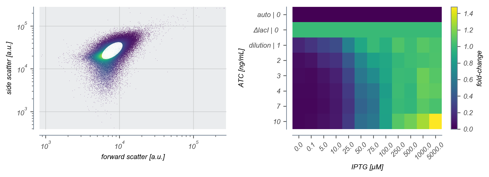
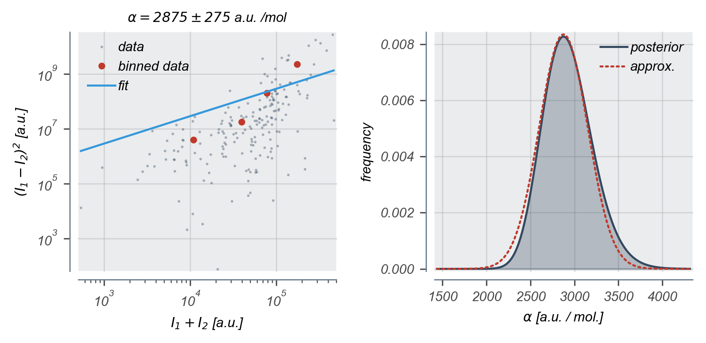
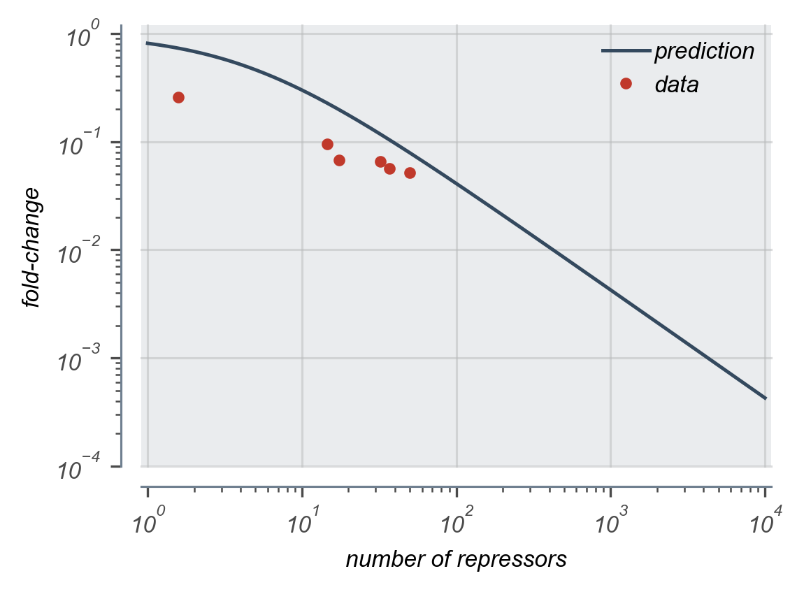

# 2018-03-12 O2 Dilution

## Purpose
This experiment preforms a full IPTG and ATC titration of the O2 dilution
strains in glucose at 37°C.

## Strain Information

| Location | Plasmid | Genotype | Host Strain | Shorthand |
| :------- | :------ | :------- | ----------: | --------: |
| dilution 1 - pos. 2 | None | `galK<>KD4+noKan, gspI<>4*5noO1v1-cfp` | HG105 | `autofluorescence` |
| dilution 1 - pos. 5 | `pZS3*PN25-tetR` | `galK<>25O2+11-YFP ybcN<>1-Wiggins2-lacI-mCherry, gspI<>4*5noO1v1-CFP` | HG105 | `dilution`|
| dilution 1 - pos. 9 | `pZS3*PN25-tetR`| `galK<>25O2+11-YFP, gspI<>4*5noO1v1-CFP` |  HG105 |`deltaLacI` |

## Titration Series

| Inducer | Concentration |
| :------ | ------------:
| Anhydrotetracycline HCl (ATC) | 0, 1, 2, 3, 4, 6, 10  [ng / mL] |
| Isopropylthiogalactopyranoside (IPTG) | 0, 0.1, 5, 10, 25, 50, 75, 100, 250, 500, 1000, 5000  [mM] |

## Notes & Observations
* The cells were diluted into ATC and IPTG media at 9h08m.
* Cells were harvested at OD600nm ~ 0.35.
* The growth movies drifted over time, resulting in messed up lineages. For
this reason, the data set was rejected.
* The flow cytometry analysis look pretty good and I believe the protocol can
be trusted.

## Analysis Files

**Flow Cytometry Measurements**

**Calibration Factor Determination**

**Fold-change**

## Experimental Protocol

1. Cells as described in "Strain Information" were grown to saturation overnight in 3mL of LB Miller + chloramphenicol for the `dilution` strain. The cells were assumed to be saturated during this time.

2. Cells were diluted 1:1000 into 3mL of M9 + 0.5% Glucose (+ chloramphenicol for the `dilution` strain) in 14mL Falcon tubes. ATC was added from a 10µg/mL stock in EtOH to the appropriate concentration.

3. Tubes were placed in a rack and covered with a plastic box to protect from photocleavage of ATC. Cells were allowed to grow for ~ 8 hours at 37°C with shaking at ~ 220 RPM.

4. Once the cells reached an OD600nm between 0.2 - 0.4, the cells were removed from the warm room. A 200µL aliquot of the `dilution` samples from ATC concentrations of 1, 2, 3, 4, 6, and 8 ng/mL were combined in a 1.5mL eppendorf tube. The remaining
wells were diluted 1:10 into a preset 96 well plate.

**Flow Cytometry**
1. The diluted 96 well plate was placed on a 4°C ice block for the duration of
the measurement. There is no way to shield the sample from light in this measurement,
so any degradation of the ATC from the room lights is neglected.

2. Aliquots of 75 µL were withdrawn from each well, gently mixed, and analyzed for 100,000
individual events. The voltage settings of the PMTs were as follows:

| Wavelength | Channel | Sensor Voltage|
|:---|:---|---:|
| 488 nm | Forward Scatter (FSC) | 423 V|
| 488 nm   | Side Scatter (SSC) | 537 V|
| 488 nm | Intensity (B1 Filter, 525/50 nm) | 790 V|
| 488 nm | Trigger (debris threshold) | 24.5 V|

3. The measurement was periodically monitored and the buffer volumes were topped
off as necessary.

4. Once completed, the data was collected and transferred to the backup server.

**Microscopy**

1. The `dilution` mixture was pelleted at 13000xg for 2 min. The supernatant was withdrawn and the pellet was resuspended in 1mL of ATC-free M9 + 0.5% glucose. This procedure was repeated twice more.

2. The washed `dilution` mixture was diluted 1:5 into ATC-free M9 + 0.5% glucose. Aliquots of 1µL were spotted onto 2% agarose pads made of M9 + 0.5% glucose.

3. Aliquots of 1µL from the other samples (`autofluorescence`, `deltaLacI`, and `dilution` for all ATC concentrations) were added to agarose pads.

4. Agarose pads spotted with cells were allowed to dry for 10 - 15 min and were then placed onto UV sterilized glass bottom dishes.

5. After mounting, the sample dish was affixed to the microscope using double stick tape. Between five and ten positions were marked per snapshot sample. Exposures were as follows:
    - Brightfield - 80ms
    - mCherry - 4000ms
    - YFP - 500ms

6. Between 20 and 30 positions were then marked on the `dilution` mixture pad. These positions were chosen requiring separation of cells and avoidance of debris.

7. These were positions were imaged every five minutes for two hours using only the Brightfield channel. After two hours, these positions were imaged once more using a Brightfield, mCherry, and YFP channels.

8. Between 15 and 20 positions were marked on a homogeneously fluorescent slide. These positions were imaged in both YFP and mCherry with the following exposures:
    - mCherry - 100ms
    - YFP - 5ms

9. Using the same positions marked on the  fluorescent slide, between 15 and 20 positions were imaged in mCherry and YFP with no illumination reaching the camera. These exposures were
    - mCherry - 4000ms
    - YFP - 500ms

10. The samples were discarded and the dataset was transferred to the storage server.

## Analysis Protocol
1. All image files were transferred to the local cluster (`delbrück`) for segmentation through SuperSegger.

2. The images were then renamed to match the required naming convention. These images were flattened using the images of the fluorescent slide and camera shot noise.

3. Blank images were created and saved for the growth series for all time points except the
terminal fluorescence image. This was performed such that SuperSegger would properly extract the fluorescence information from the final image. Fluorescence images are needed at all time steps for this to work.

4. After segmentation was complete, All `clist.mat` files were transferred to a local computer to analyze. These files were loaded and filtered based on size and aspect ratio. The fluctuations were computed and the best-fit for the calibration factor was determined via optimization.
