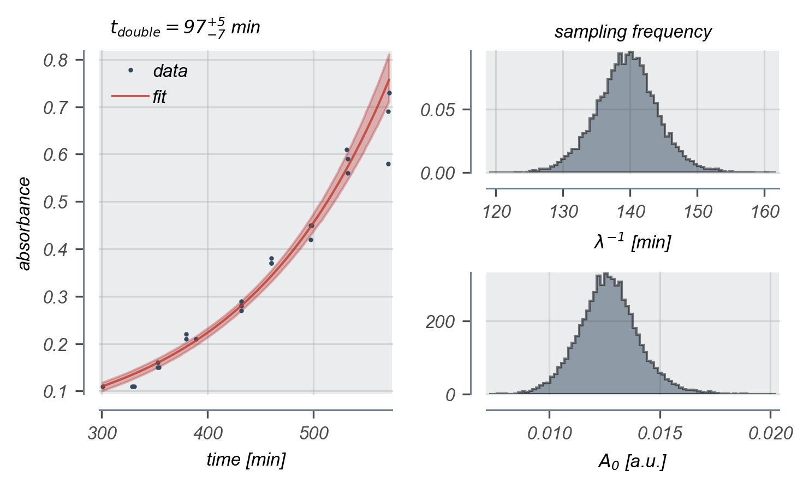

# 2018-02-21 Growth Measurement (Run 2)

## Purpose
This experiment is the first pass at measuring the growth rate of the *E. coli*
strains of interest in M9 + 0.5% glucose at 37°C. This file corresponds to the
second run, although both experiments were conducted concurrently.

## Strain information
| Location | Plasmid | Genotype | Host Strain | Shorthand |
| :------  | :------ | :------- | ----------: | --------: |
| dilution 1 - pos. 5  | `pZS3*PN25-tetR` | `galK<>25O2+11-YFP`   | HG105 | `dilution`  |

## Titration Series

| Inducer | Concentration |
| :-----  | ------------: |
| Anhydrotetracycline HCl (ATC) | 0 ng / mL |
| Isopropylthiogalactopyranoside (IPTG) | 0 mM |

## Notes & Observations
* Inoculum OD600nm was ~ 0.5 and was diluted 1:100 into the growth medium.
* The run was started at 07h56m.
* The estimated doubling is again very large, about 1.5 times that I would expect
for this particular growth medium.

## Analysis Files

## Experimental Protocol

1. Cells from an overnight saturated LB culture were diluted 1:3000 into 3 mL of M9 + 0.5% glucose + chloramphenicol in a 15 mL Falcon tube. The inoculum was stored at room temperature for several hours prior to the inoculation.

2. Cells grew overnight (12h) at 37°C shaking at 225 RPM.

3. The OD600nm of these cells were measured and were diluted into 50 mL of prewarmed M9 + 0.5% glucose + chloramphenicol and was thoroughly mixed.

4. Aliquots of 500 µL were serially pipetted to fill two 96-well plates (2 mL maximal volume). These plates were covered with breathable nylon covers and were loosely wrapped with foil.

5. These cultures were allowed to grow at 37°C while shaking at 225 RPM. Growth measurements were taken hourly unless otherwise noted.

6. Growth measurements were performed by puncturing the nylon cover with a pipette and withdrawing 500 µL of culture. This aliquot was then transferred to a plastic cuvette (2 mL maximal volume) and measured using a table-top spectrophotometer. An M9 blank was measured at each time point and used as a reference.

## Analysis Protocol

1. The elapsed time was calculated manually in the spreadsheet and was exported
to a `.csv` file.

2. The data was read and was trimmed only to the region of absorbance between
0.1 and 1.0 a.u. I defined exponential growth to be in this region.

3. The initial absorbance (A0), growth constant (λ), and likelihood
scale parameter (γ from a Cauchy likelihood) was inferred via MCMC.
