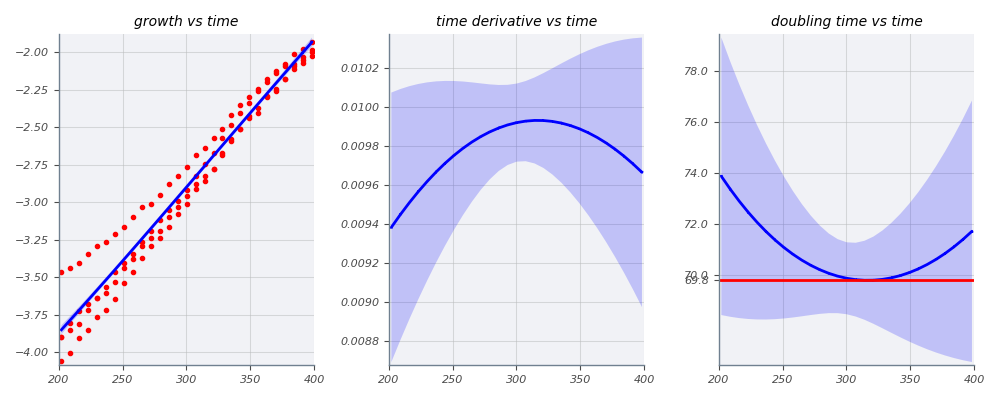
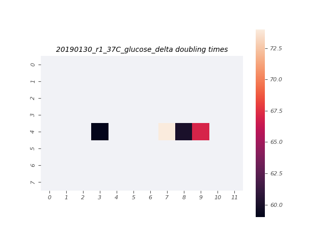

# 2019-01-30 37C Glucose O2 Plate Reader Growth Measurement

## Purpose
This experiment aims to measure the growth rate of the *E. coli* strains of interest in M9 + 0.5% glucose at 37°C.

## Notes & Observations
* Saturated LB cultures of `deltaLacI`, `ManuelDelta`, `GenevaLE`, and `GenevaBW` were diluted 1000x into M9 + 0.5% glucose about 4 hours prior to start of measurement.
* `GenevaLE` and `GenevaBW` LB cultures (donated by the Van Valen Lab on the morning of 2019-01-29) were stored at 4˚C until dilution.
* The OD_600nm of the cultures prior to being added to the plate were: `deltaLacI`: ~0.07, `ManuelDelta`: ~0.07, `GenevaLE`: ~0.05, and `GenevaBW`: ~0.13.
* The four samples were diluted 5x into the plate.

## Analysis Files

**Whole Plate Growth Curves**

**Per Well Growth Rate Heatmap**
[]

## Experimental Protocol

1. A culture of `deltaLacI` was grown to saturation in 3mL of LB Miller. Saturated LB cultures of the strains `GenevaBW` and `GenevaLE` were supplied by Geneva in the Van Valen lab.

2. Saturated cultures of `deltaLacI`, `ManuelDelta`, `GenevaLE`, and `GenevaBW` were diluted 1000x in M9 + 0.5% glucose in 14mL Falcon tubes and allowed to grow for about 4 hours.

3. Cells were removed from the shaker and the four cultures were diluted 1:5.

4. 100µL of water were added to the first and last two rows and columns of a round-welled, clear-bottomed 96 well plate, the total capacity of which was 250µL. 100µL of each culture were added to the remaining wells in the arrangement depicted in the output file 'growth_plate_layout.png'.

5. Double-sided tape was placed between the edges of the plate and the lid to prevent them rubbing and creating plastic dust.

6. The plate was placed in a Biotek Gen5 plate reader and grown at 37C, shaking in a linear mode at the fastest speed. Measurements were taken every 7 minutes for approximately 18 hours.