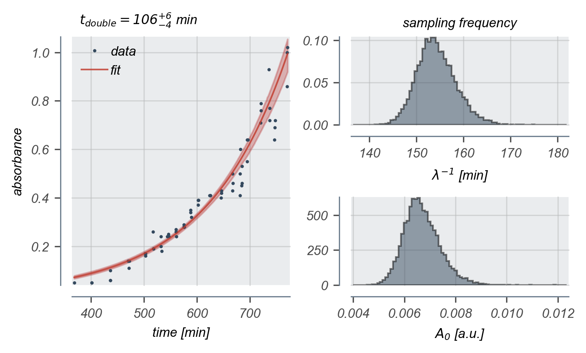

# 2018-02-16 Growth Measurement

## Purpose
This experiment is the first pass at measuring the growth rate of the *E. coli*
strains of interest in M9 + 0.5% glucose at 37°C.

## Strain information
| Location | Plasmid | Genotype | Host Strain | Shorthand |
| :------  | :------ | :------- | ----------: | --------: |
| dilution 1 - pos. 5  | `pZS3*PN25-tetR` | `galK<>25O2+11-YFP`   | HG105 | `dilution`  |

## Titration Series

| Inducer | Concentration |
| :-----  | ------------: |
| Anhydrotetracycline HCl (ATC) | 5 ng / mL |
| Isopropylthiogalactopyranoside (IPTG) | 0 mM |

## Notes & Observations
* Initial inoculum for growth measurements was at an OD600nm ~ 0.96.
* The doubling time of ~100 min is larger than the expected ~60 min that is standard
in this growth medium and temperature. It is possible that the ATC slows the growth
rate of this strain. This experiment should be repeated and other growth curves
with different concentrations of ATC and IPTG should be measured.

## Analysis Files

## Experimental Protocol

1. Cells from an overnight saturated LB culture were diluted 1:1000 into 3 mL  of M9 + 0.5% glucose + 5 ng/mL ATC + chloramphenicol in a 15 mL Falcon tube. The inoculum was stored at 4°C for several hours prior to the dilution.

2. Cells grew overnight at 37°C shaking at 225 RPM shielded from light to protect against photocleavage of the ATC. These cells grew for approximately 10 hours.

3. The OD600nm of these cells were measured and were diluted 1:500 into 96 mL of prewarmed M9 + 0.5% glucose + 5 ng/mL ATC + chloramphenicol and was thoroughly mixed.

4. Aliquots of 500 µL were serially pipetted to fill two 96-well plates (2 mL maximal volume). These plates were covered with breathable nylon covers and were loosely wrapped with foil.

5. These cultures were allowed to grow at 37°C while shaking at 225 RPM. Growth measurements were taken hourly unless otherwise noted.

6. Growth measurements were performed by puncturing the nylon cover with a pipette and withdrawing 500 µL of culture. This aliquot was then transferred to a plastic cuvette (2 mL maximal volume) and measured using a table-top spectrophotometer. An M9 blank was measured at each time point and used as a reference.

## Analysis Protocol

1. The elapsed time was calculated manually in the spreadsheet and was exported
to a `.csv` file.

2. The data was read and was trimmed only to the region of absorbance between
0.1 and 1.0 a.u. I defined exponential growth to be in this region.

3. The initial absorbance (A0), growth constant (λ), and likelihood
scale parameter (γ from a Cauchy likelihood) was inferred via MCMC.
