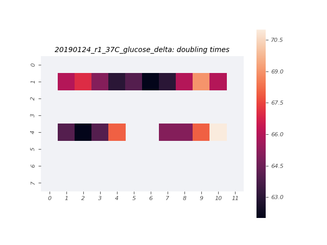

# 2019-01-24 37C Mixed Media O2 Plate Reader Growth Measurement

## Purpose
TThis experiment aims to measure the growth rate of the *E. coli* strains of interest in M9 + 0.5% glucose, M9 + 0.5% glycerol, and M9 + 0.5% acetate at 37°C.

## Strain Information

| Location | Plasmid | Genotype | Host Strain | Shorthand |
| :------- | :------ | :------- | ----------: | --------: |
| dilution 1 - pos. 9 | `pZS3*PN25-tetR`| `galK<>25O2+11-YFP, gspI<>4*5noO1v1-CFP` |  HG105 |`deltaLacI` |

## Notes & Observations
* `deltaLacI` was grown to saturation in LB, then diluted 1000x in M9 + 0.5% glucose, M9 + 0.5% glycerol, and M9 + 0.5% acetate about 8.5 hours prior to start of measurement.
* The glucose sample was diluted 3x from an OD_600nm of 0.47 about an hour before measurement, and was diluted 25x from an OD_600nm of 0.25 into the plate.
* The glycerol and acetate samples were at negligible OD_600nm (<0.05) at the time of measurement and not diluted into the plate.
* Plastic dust was observed on the plate at the completion of the experiment, as well as noise in the growth curves of the center wells.

## Analysis Files

**Whole Plate Growth Curves**

**Per Well Growth Rate Heatmap**
[]

## Experimental Protocol

1. Cells as described in "Strain Information" were grown to saturation in 3mL of LB Miller.

2. The cells were diluted 1000x into M9 + 0.5% glucose, M9 + 0.5% glycerol, and M9 + 0.5% acetate in 14mL Falcon tubes and allowed to grow for about 8.5 hours. The glucose sample was diluted 1:3 after about 7.5 hours.

3. Cells were removed from the shaker and the glucose sample was diluted 1:25 from an OD_600nm of 0.25.

4. 100µL of water were added to the first and last row and column of a round-welled, clear-bottomed 96 well plate, the total capacity of which was 250µL. 100µL of each culture were added to the remaining wells in the arrangement depicted in the output file 'growth_plate_layout.png'.

5. The plate was placed in a Biotek Gen5 plate reader and grown at 37C, shaking in a linear mode at the fastest speed. Measurements were taken every 7 minutes for approximately 24 hours.