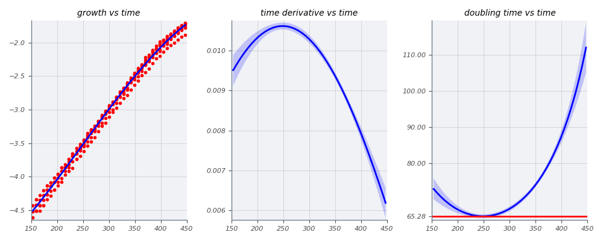
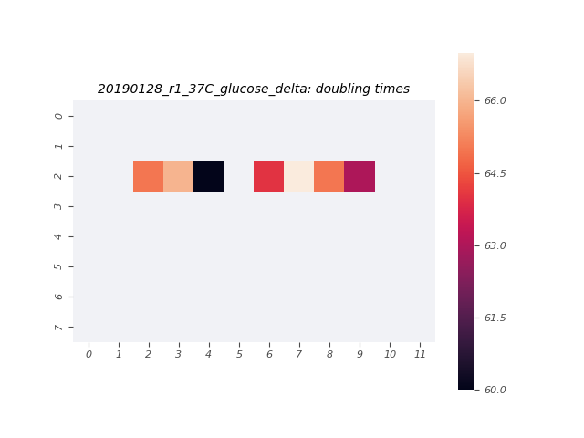

# 2019-01-28 37C Mixed Media Multistrain Plate Reader Growth Measurement

## Purpose
This experiment aims to measure the growth rate of the *E. coli* strains of interest in M9 + 0.5% glucose and LB at 37°C.

## Notes & Observations
* `deltaLacI` and `ManuelDelta` were grown to saturation in LB, and diluted 1000x in M9 + 0.5% glucose about 7 hours prior to start of measurement.
* The `deltaLacI` glucose sample was diluted 50x into the plate from an OD_600nm of 0.54.
* The `ManuelDelta` glucose sample was diluted 30x into the plate from an OD_600nm of 0.30.

## Analysis Files

**Whole Plate Growth Curves**

**Per Well Growth Rate Heatmap**
[]

## Experimental Protocol

1. Cultures of `deltaLacI` and `ManuelDelta` were grown to saturation in 3mL of LB Miller.

2. Saturated cultures of `deltaLacI` and `ManuelDelta` were diluted 1000x in M9 + 0.5% glucose in 14mL Falcon tubes and allowed to grow for about 7 hours.

3. Cells were removed from the shaker and diluted. The `deltaLacI`sample was diluted 1:50, and the `ManuelDelta` sample was diluted 1:30.

4. 100µL of water were added to the first two and last two rows and columns of a round-welled, clear-bottomed 96 well plate, the total capacity of which was 250µL. 100µL of each culture were added to the remaining wells in the arrangement depicted in the output file 'growth_plate_layout.png'.

5. The plate was placed in a Biotek Gen5 plate reader and grown at 37C, shaking in a linear mode at the fastest speed. Measurements were taken every 7 minutes for approximately 12 hours.