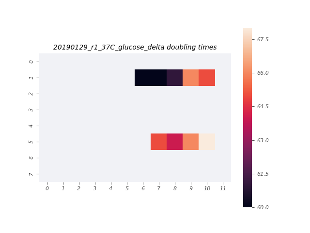

# 2019-01-29 37C Mixed Media Multistrain Plate Reader Growth Measurement

## Purpose
This experiment aims to measure the growth rate of the *E. coli* strains of interest in M9 + 0.5% glucose and LB at 37°C.

## Notes & Observations
* `deltaLacI` and `ManuelDelta` were grown to saturation in LB, and diluted 1000x in M9 + 0.5% glucose about 7 hours prior to start of measurement.
* The `deltaLacI` glucose sample was diluted 30x into the plate.
* The `ManuelDelta` glucose sample was diluted 10x into the plate.
* `GenevaLE` and `GenevaBW` (donated by the Van Valen Lab) were grown in LB to saturation.
* Two wells and two rows were switched from their intended layout, which is reflected in the analysis.
* Plastic dust was observed on the plate at the completion of the experiment, as well as noise in the growth curves of the center wells.

## Analysis Files

**Whole Plate Growth Curves**

**Per Well Growth Rate Heatmap**
[]

## Experimental Protocol

1. A culture of `deltaLacI` was grown to saturation in 3mL of LB Miller. Saturated LB cultures of the strains `GenevaBW` and `GenevaLE` were supplied by Geneva in the Van Valen lab.

2. Saturated cultures of `deltaLacI` and `ManuelDelta` were diluted 1000x in M9 + 0.5% glucose in 14mL Falcon tubes and allowed to grow for about 7 hours.

3. Cells were removed from the shaker. The `deltaLacI`sample was diluted 1:30, and the `ManuelDelta` sample was diluted 1:10.

4. 100µL of water were added to the first and last row and column of a round-welled, clear-bottomed 96 well plate, the total capacity of which was 250µL. 100µL of each glucose and LB culture were added to the remaining wells in the arrangement depicted in the output file 'growth_plate_layout.png'.

5. The plate was placed in a Biotek Gen5 plate reader and grown at 37C, shaking in a linear mode at the fastest speed. Measurements were taken every 7 minutes for approximately 18 hours.