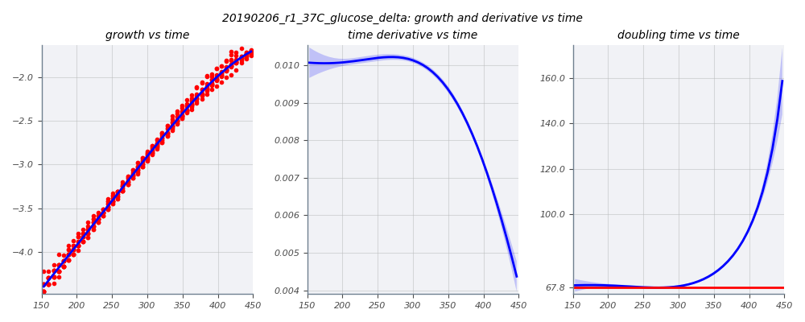
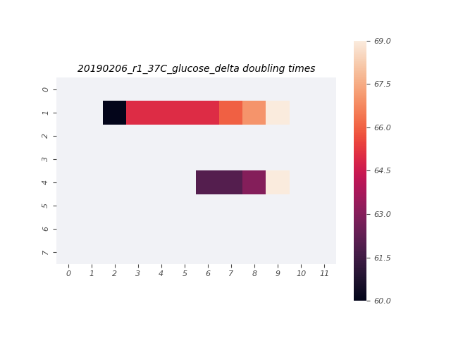

# 2019-02-06 37C Multimedia O2 Plate Reader Growth Measurement

## Purpose
This experiment aims to measure the growth rate of the *E. coli* strains of interest in M9 + 0.5% glucose, M9 + 0.5% glycerol, and M9 + 0.5% acetate at 37°C.

## Strain Information

| Location | Plasmid | Genotype | Host Strain | Shorthand |
| :------- | :------ | :------- | ----------: | --------: |
| dilution 1 - pos. 9 | `pZS3*PN25-tetR`| `galK<>25O2+11-YFP, gspI<>4*5noO1v1-CFP` |  HG105 |`deltaLacI` |

## Notes & Observations
* `deltaLacI` was grown to saturation in LB, then diluted 1000x in M9 + 0.5% glucose, M9 + 0.5% glycerol, and M9 + 0.5% acetate about 5 hours prior to start of measurement.
* The glucose culture was diluted 10x into the plate (from OD_600nm ~0.09). The glycerol and acetate cultures had OD_600nm <0.05 and were not diluted into the plate.

## Analysis Files

**Whole Plate Growth Curves**

**Per Well Growth Rate Heatmap**
[]

## Experimental Protocol

1. Cells as described in "Strain Information" were grown to saturation in 3mL of LB Miller.

2. Cells were diluted 1:1000 into the three growth media in 14mL Falcon tubes and allowed to grow for about 5 hours.

3. Cells were removed from the shaker and the M9 + 0.5% glucose culture was diluted 1:10.

4. 100µL of water were added to the first and last row, and the first and last two columns of a round-welled, clear-bottomed 96 well plate, the total capacity of which was 250µL. 100µL of each culture were added to the remaining wells in the arrangement depicted in the output file 'growth_plate_layout.png'.

5. Double-sided tape was placed between the edges of the plate and the lid to prevent them rubbing and creating plastic dust.

6. The plate was placed in a Biotek Gen5 plate reader and grown at 37C, shaking in a linear mode at the fastest speed. Measurements were taken every 7 minutes for approximately 40 hours.