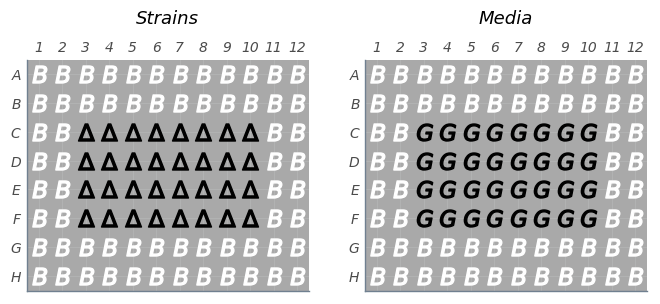
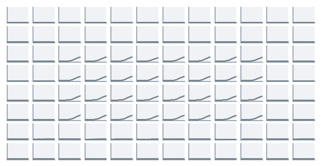

# 2019-02-28 32C Glucose O2 Plate Reader Growth Measurement

## Purpose
This experiment aims to measure the growth rate of the *E. coli* strains of interest in M9 + 0.5% glucose at 32°C.

## Notes & Observations
* A `deltaLacI` LB culture was grown to saturation, then diluted 1000x into a 96 well plate of growth media immediately prior to start of measurement.
* Measurements were taken in the Van Valen Lab Biotek Gen5 plate reader.
* The 96 well plate used had square wells and a total capacity of 700µL, with 300µL of culture added to each well.
* The plate was shaken in a linear mode at the fastest speed for the duration of the experiment.
* Measurements were taken every 7 min for 17 hours.

## Analysis Files

**Plate Layout**

**Growth Curves**
[]