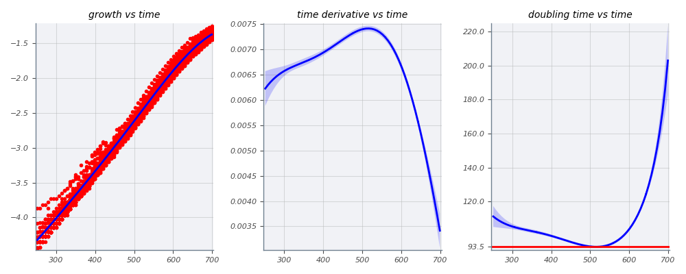
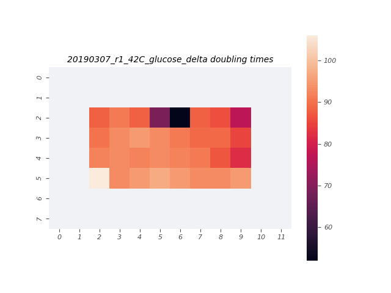

# 2019-03-07 42C Glucose O2 Plate Reader Growth Measurement

## Purpose
This experiment aims to measure the growth rate of the *E. coli* strains of interest in M9 + 0.5% glucose at 42°C.

## Strain Information

| Location | Plasmid | Genotype | Host Strain | Shorthand |
| :------- | :------ | :------- | ----------: | --------: |
| dilution 1 - pos. 9 | `pZS3*PN25-tetR`| `galK<>25O2+11-YFP, gspI<>4*5noO1v1-CFP` |  HG105 |`deltaLacI` |

## Notes & Observations

## Analysis Files

**Whole Plate Growth Curves**

**Per Well Growth Rate Heatmap**
[]

## Experimental Protocol

1. Cells as described in "Strain Information" were grown to saturation in 3mL of LB Miller.

2. Cells were diluted 1:1000 into 10mL of growth media in a 14mL Falcon tube.

3. 300µL of water were added to the first and last two rows and columns of a square-welled, clear-bottomed 96 well plate, the total capacity of which was 700µL. 300µL of cells were added to the remaining wells.

4. The plate was placed in a Biotek Gen5 plate reader and grown at 42C, shaking in a linear mode at the fastest speed. Measurements were taken every 7 minutes for approximately 24 hours.