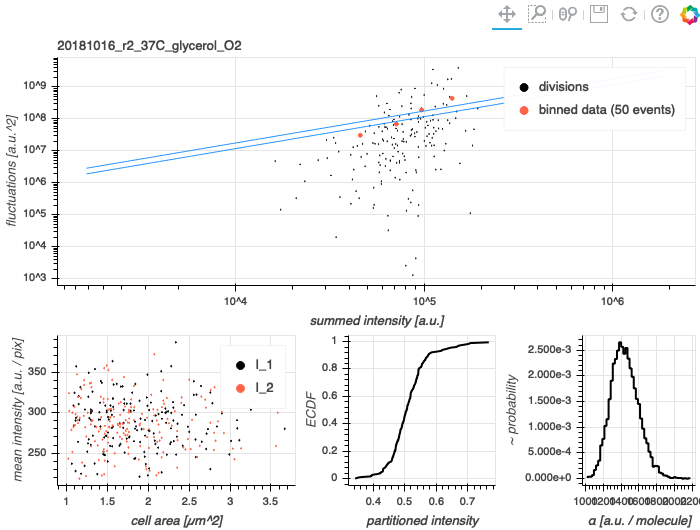
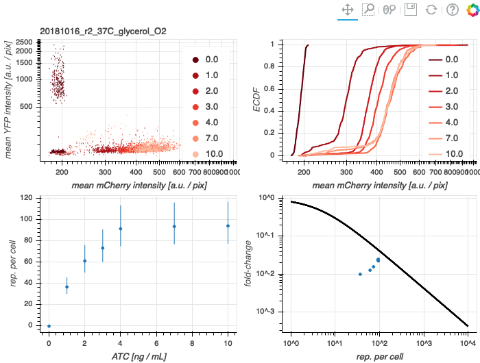

# 2018-10-16 37C Glycerol O2 Dilution (Run 2)

## Purpose
A biological replicate of a glycerol dilution series.

## Strain Information

| Location | Plasmid | Genotype | Host Strain | Shorthand |
| :------- | :------ | :------- | ----------: | --------: |
| dilution 1 - pos. 2 | None | `galK<>KD4+noKan, gspI<>4*5noO1v1-cfp` | HG105 | `autofluorescence` |
| dilution 1 - pos. 5 | `pZS3*PN25-tetR` | `galK<>25O2+11-YFP ybcN<>1-Wiggins2-lacI-mCherry, gspI<>4*5noO1v1-CFP` | HG105 | `dilution`|
| dilution 1 - pos. 9 | `pZS3*PN25-tetR`| `galK<>25O2+11-YFP, gspI<>4*5noO1v1-CFP` |  HG105 |`deltaLacI` |

## Titration Series

| Inducer | Concentration |
| :------ | ------------: |
| Anhydrotetracycline HCl (ATC) | 0, 1, 2, 3, 4, 7, 10  [ng / mL] |
| Isopropylthiogalactopyranoside (IPTG) | None |

## Notes & Observations
* Cells were grown overnight from a 1:1000 dilution followed by a 1:100 dilution into fresh media with ATC to adjust for improper OD. The cells imaged in this experiment were harvested between 0.3 and 0.45 OD_600nm_.
* Snapshot samples were accidentally diluted into glycerol rather than no-carbon M9.

## Analysis Files

**Calibration Factor Determination**

**Fold-change**

## Experimental Protocol

1. Cells as described in "Strain Information" were grown to saturation overnight in 3mL of LB Miller + chloramphenicol for the `dilution` strain. The cells were assumed to be saturated during this time.

2. Cells were diluted 1:1000 into 3mL of M9 + 0.5% glycerol (+ chloramphenicol for the `dilution` strain) in 14mL Falcon tubes. ATC was added from a 1µg/mL stock in 50% EtOH to the appropriate concentration.

3. Tubes were placed in a rack and covered with a plastic box to protect from photocleavage of ATC. Cells were allowed to grow for ~ 14 hours at 37°C with shaking at ~ 220 RPM. The cells grew to near saturation overnight (OD_600nm_ ~ 0.9) and were further diluted 1:100 and allowed to growth for 9 more hours.

4. Once the cells reached an OD600nm between 0.2 - 0.4, the cells
were removed from the warm room. A 100µL aliquot of the `dilution` samples
from ATC concentrations of 1, 2, 3, 4, 7, and 10 ng/mL were combined in a 1.5mL eppendorf tube. The remaining
wells were diluted 1:10 into an M9 growth medium.

**Microscopy**

1. The `dilution` mixture was pelleted at 13000xg for 2 min. The supernatant was withdrawn and the pellet was resuspended in 1mL of ATC-free M9 + 0.5% glycerol. This procedure was repeated twice more.

2. The washed `dilution` mixture was diluted 1:5 into ATC-free M9 + 0.5% glycerol. Aliquots of 1µL were spotted onto 3% agarose pads made of M9 + 0.5% glycerol.

3. Aliquots of 1µL from the other samples (`autofluorescence`, `deltaLacI`, and `dilution` for all ATC concentrations) were added to agarose pads
made of M9 medium with no added carbon.

4. Agarose pads spotted with cells were allowed to dry for 10 - 15 min and were then placed onto a glass bottom dish.

5. After mounting, the sample dish was affixed to the microscope using double stick tape. Between five and ten positions were marked per snapshot sample. Exposures were as follows:
    - Brightfield - 100ms
    - mCherry - 5000ms
    - YFP - 5000ms

6. Approximately 15 positions were then marked on the `dilution` mixture pad. These positions were chosen requiring separation of cells and avoidance of debris.

7. These were positions were imaged every 7 minutes for 2 hours using only the Brightfield channel. Afterward, these positions were imaged once more using a Brightfield, mCherry, and YFP channels.

8. The samples were discarded and the dataset was transferred to the storage server.