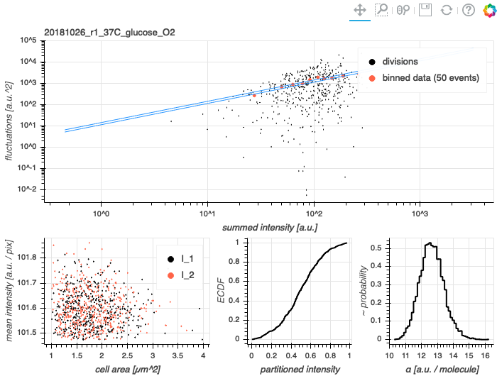
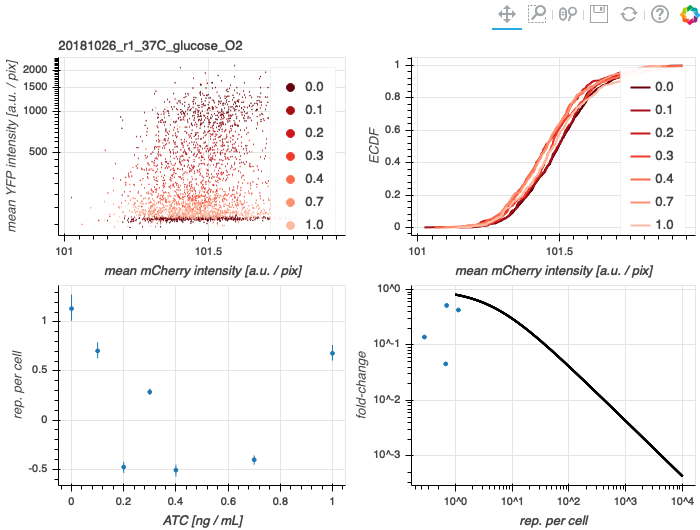

# 2018-10-26 37C Glucose O2 Dilution

## Purpose
This experiment was a biological replicate of a low atc induction series.

## Strain Information

| Location | Plasmid | Genotype | Host Strain | Shorthand |
| :------- | :------ | :------- | ----------: | --------: |
| dilution 1 - pos. 2 | None | `galK<>KD4+noKan, gspI<>4*5noO1v1-cfp` | HG105 | `autofluorescence` |
| dilution 1 - pos. 5 | `pZS3*PN25-tetR` | `galK<>25O2+11-YFP ybcN<>1-Wiggins2-lacI-mCherry, gspI<>4*5noO1v1-CFP` | HG105 | `dilution`|
| dilution 1 - pos. 9 | `pZS3*PN25-tetR`| `galK<>25O2+11-YFP, gspI<>4*5noO1v1-CFP` |  HG105 |`deltaLacI` |

## Titration Series

| Inducer | Concentration |
| :------ | ------------: |
| Anhydrotetracycline HCl (ATC) | 0, 0.1, 0.2, 0.3, 0.4, 0.7, 1, 10 [ng / mL] |
| Isopropylthiogalactopyranoside (IPTG) | None |

## Notes & Observations
* Cells were harvested at OD600nm 0.25 - 0.45, except for auto, which was at 0.5. 
* The `deltaLacI` strain was at a different OD than the others, potentially due to an error during dilution, as the tube only had 2mL instead of 3mL culture volume. This sample was back diluted 2x.
* All samples were back diluted 2x to adjust the experiment timing.

## Analysis Files

**Calibration Factor Determination**

**Fold-change**

## Experimental Protocol

1. Cells as described in "Strain Information" were grown to saturation in 3mL of LB Miller (+ chloramphenicol for the `dilution` strain).

2. Cells were diluted 1:1000 into 3mL of growth media (+ chloramphenicol for the `dilution` strain) in 14mL Falcon tubes. ATC was added from a 1µg/mL stock in 50% EtOH to the appropriate concentration. It seems likely `deltaLacI` was diluted into only 2mL accidentally.

3. Tubes were placed in a rack and covered with a plastic box to protect from photocleavage of ATC. Cells were allowed to grow for 8 hours at 37°C with shaking at ~ 220 RPM. ~3.5 hours before harvesting, the `deltaLacI` sample was diluted 1:2 to bring it to the OD600nm of the other samples. ~1.5 hours before harvesting, all samples were diluted 1:2 to adjust experimental timing.

4. Once the cells reached an OD600nm between 0.25 - 0.45, the cells were removed from the warm room and harvested.

**Microscopy**

1. A 100µL aliquot of each of the `dilution` samples with varying ATC concentrations were combined in a 1.5mL eppendorf tube.

2. This `dilution` mixture was pelleted at 13000xg for 2 min. The supernatant was withdrawn and the pellet was resuspended in 1mL of ATC-free growth medium. This procedure was repeated twice more.

3. The washed `dilution` mixture was diluted 1:5 into ATC-free growth medium. Aliquots of 1µL were spotted onto 3% agarose pads made of the growth medium.

4. The other samples (`autofluorescence`, `deltaLacI`, and `dilution` for all ATC concentrations except 10ng/mL) were diluted 1:10 into a growth medium with no available carbon. Aliquots of 1µL were added to agarose pads made of the growth medium with no added carbon.

5. Agarose pads spotted with cells were allowed to dry and were then placed onto a glass bottom dish.

6. After mounting, the sample dish was affixed to the microscope using double stick tape. Between five and ten positions were marked per snapshot sample. Exposures were as follows:
    - Brightfield - 100ms, gain 4, 12bit
    - mCherry - 5000ms, gain 1, 12bit
    - YFP - 5000ms, gain 1, 12bit

7. Approximately 15 positions were then marked on the `dilution` mixture pad. These positions were chosen requiring separation of cells and avoidance of debris.

8. These were positions were imaged every 5 minutes for 1.5 hours using only the Brightfield channel. After this timelapse, these positions were imaged once more using Brightfield, mCherry, and YFP channels.

9. The samples were discarded and the dataset was transferred to the storage server.